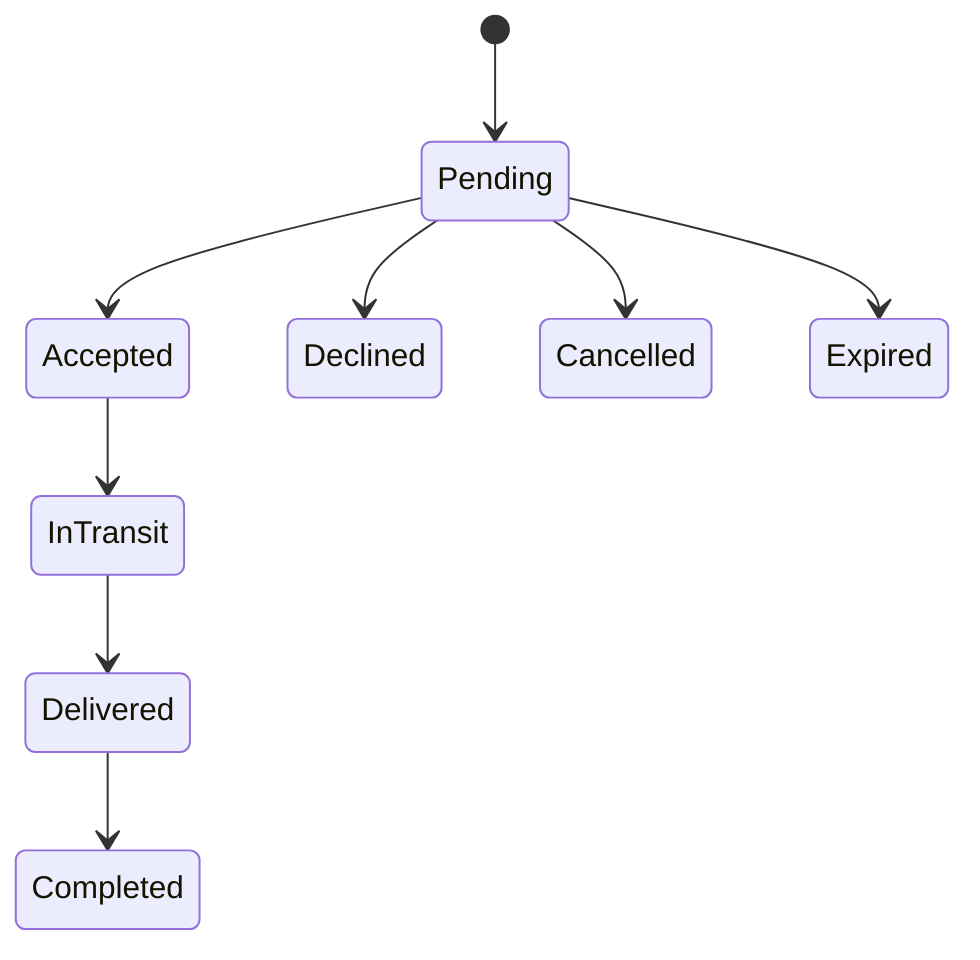

# Booking State Machine

## Purpose

Define the finite booking lifecycle, actor permissions, persisted history, and enforcement layers.

## Scope

The machine covers pending, accepted, in-transit, delivered, completed, cancelled, declined, and expired. Payments, disputes, and exception states are excluded.

## Current implementation

`bookingStateMachine.ts` allows only:

`BookingService` assigns traveler actions to accept, decline, pickup, and delivery; sender actions to pending cancellation and completion; and reserves expiration for `system`. Each transition appends a `statusHistory` entry containing status, actor, and timestamp.

Home creates pending requests from eligible matches. Tracking exposes only role/status-compatible actions. Firestore rules independently enforce the allowlist, actor, immutable booking core, appended history, and paired request outcomes.

## Design principles

- No implicit, backward, or terminal-state transitions.
- UI controls are guidance; services and rules remain authoritative.
- Request and booking outcomes move together in one batch.
- Status history is append-only.
- Custody facts complement status but do not rewrite it.
- Deterministic IDs make repeated request creation fail closed.

## Future direction

Move commands to Cloud Functions with explicit versions, idempotency receipts, capacity transactions, automatic expiration, durable events, and Emulator Suite allow/deny tests. Add exception states only after product/support policy exists.

## Out of scope

- Payments, disputes, partial delivery, rollback, and client-triggered expiration.
- Claiming mobile validation replaces trusted server execution for production.

## Related documents

- [Booking Lifecycle](../product/booking-lifecycle.md)
- [Custody Model](custody-model.md)
- [Application Services](application-services.md)
- [API Design](../engineering/api-design.md)
