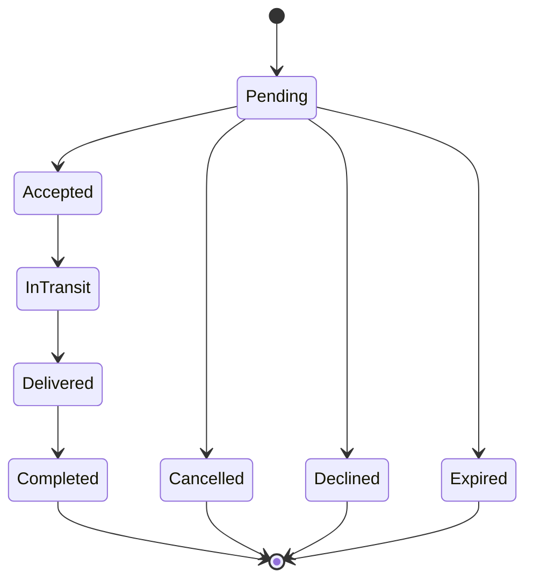

# Booking State Machine

## Purpose

Define the finite booking lifecycle and the guards that prevent invalid or backward transitions.

## Scope

The state machine covers pending, accepted, in-transit, delivered, completed, cancelled, declined, and expired bookings. It does not define payment or dispute states.

## Current implementation

`apps/mobile/src/domain/booking/bookingStateMachine.ts` implements the exact allowed transitions:

The persisted values are lowercase snake-case strings. `canTransitionBooking` reports eligibility, and `transitionBooking` throws `InvalidBookingTransitionError` for every other edge. Terminal states have no outgoing transitions.

`BookingService` adds actor guards: the traveler accepts, declines, starts transit, and marks delivery; the sender cancels a pending request and completes a delivered booking; only the trusted `system` actor expires a request. It updates request outcome with booking state and publishes the corresponding completed event after repository persistence.

This is a compile-safe application foundation. No screen calls it, current rules deny booking writes, and production transitions still require a transactional Cloud Function.

## Design principles

- State moves forward only through an explicit allowlist.
- Terminal states are immutable.
- Actor authorization and current-state validation are separate checks.
- Accepted terms must be snapshotted before later listing edits.
- Retried commands are idempotent in trusted code.
- Custody events append evidence; they do not create hidden backward state.

## Future direction

Move command execution to Cloud Functions, add optimistic-concurrency or version checks, transact booking and request changes, record durable events, and test every allowed and denied edge in the Emulator Suite. Product work must define capacity reservation, expiration timing, recipient confirmation, and exception handling before expanding the graph.

## Out of scope

- Payments, disputes, exceptions, partial delivery, or backwards correction states.
- Direct mobile authorization to write booking status.
- UI tracking screens in this milestone.

## Related documents

- [Booking Lifecycle](../product/booking-lifecycle.md)
- [Application Services](application-services.md)
- [Custody Model](custody-model.md)
- [API Design](../engineering/api-design.md)
