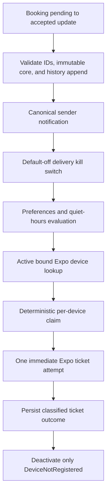

# Notification Activation and Delivery Design

## Status and guardrails

This document covers the controlled client foundation, trusted persistence backend (N1), mobile repository wiring (N2), and bounded trusted `booking.accepted` delivery (N3A).

The following functionality is **implemented**:
- N1 trusted push-token persistence
- N2 FirebasePushTokenRepository wiring for Android/iOS Expo tokens
- N3A trusted `bookings/{bookingId}` `pending` to `accepted` Firestore trigger in `us-east1`
- server-derived sender recipient and traveler actor with immutable-core and append-only-history validation
- deterministic server-owned canonical `booking.accepted` notification
- exact complete-schema preference validation with fail-closed partial/malformed-record handling and DST-aware quiet-hours suppression
- deterministic document-ID inspection of at most 100 active, bound Expo Android/iOS registration records with in-memory token deduplication
- at most 100 deterministic per-device delivery claims and one immediate Expo provider request containing at most 100 messages
- generic schema-v1 `open_notifications` payload on `karri_activity_v1`
- immediate `DeviceNotRegistered` deactivation and token deletion
- default-off server delivery kill switch (`KARRI_PUSH_DELIVERY_ENABLED`)
- explicit Profile registration
- existing local notification-response listening and route resolution

The following functionality is **deferred**:
- other notification events
- receipt polling
- automatic retries
- queues and scheduled quiet-hours delivery
- background workers
- monitoring dashboards
- automatic registration at login or startup
- automatic unregistration at logout
- startup or foreground reconciliation
- preference-disable or permission-revocation cleanup
- token rotation
- automatic logout cleanup
- production enablement and deployment
- App Check enforcement
- scheduled cleanup
- leases
- keyed token hashes for future retention/deduplication work
- lastSeenAt
- broader device-retention policy, registration pagination, cleanup, and multi-batch fan-out

Note: `unregisterPushToken` is called only when an explicit caller invokes `repository.remove`. No automatic lifecycle caller currently exists. Push notifications are not production-complete.

N3A deterministically orders one recipient's device subcollection by document ID and examines at most the first 100 registration records. Registrations beyond that bound are ignored in this phase: they are not paged, queued, claimed, or disclosed. After existing validation and in-memory token deduplication, N3A claims and sends no more than 100 delivery effects/messages in one Expo request. This cap is a safety and resource boundary for the bounded N3A event, not a production-scale broadcast design. Broader retention policy, pagination, cleanup, and multi-batch fan-out remain deferred.

Creation of the deterministic canonical notification is N3A's event-level dispatch claim. Only the invocation that creates it may read the kill switch or preferences, evaluate quiet hours, inspect registrations, claim device effects, call Expo, or clean up an invalid registration. A matching duplicate returns `event_replay` without reevaluating changed policy, time, or token state, so every first-invocation suppression is terminal for that event. A conflicting deterministic notification still fails closed. A crash after canonical creation but before device claiming can lose the optional push; this is an accepted N3A at-most-one-attempt tradeoff because the in-app notification remains authoritative. No retry, queue, delayed delivery, or historical catch-up behavior is added.

The activation order is deliberate:

1. Keep an in-app notification record as the canonical user-visible fact.
2. Keep native permission/token acquisition behind explicit user intent.
3. Keep N3A bounded to one validated event, fail-closed policy, deterministic one-attempt effects, and a default-off server kill switch.
4. Require retries, receipts, monitoring, lifecycle reconciliation, and operational approval before any production rollout. Push remains an optional hint, never the only record of a booking, custody, delivery, review, or trust event.

## Reviewed architecture boundary

| Layer | Current responsibility | Hard boundary |
| --- | --- | --- |
| Domain | Notification records, preference rules, categories, channels, and quiet-hours values | No Firebase, Expo, FCM, APNs, permission, token, or navigation APIs |
| Application | In-app notification orchestration for non-migrated events, push registration contracts, and semantic action routing | `booking.accepted` materialization is no longer owned by the mobile event bus |
| Infrastructure | Firestore repositories, implemented token persistence and repository wiring, validated payload routing, and explicit Expo native registration adapter | Mobile delivery remains inert; permission/token acquisition is user-initiated and N3A provider access exists only on the trusted server |
| Presentation | Profile notification/preference UI, availability hook, Expo Router target adapter, composition root, explicit Profile permission/token orchestration, and existing notification-response listener and route resolution | Screens/components do not call Firebase directly; no permission prompt, token effect, or automatic navigation outside explicit Profile interaction |
| Trusted server (N1 persistence) | Authenticated token registration/unregistration callables, token deletion, and inactive-record reconciliation | Direct client access to the pushTokenRegistrations collection is denied; only us-east1 server callables run Firestore transactions |
| Trusted server delivery (N3A) | Validate one authoritative booking transition, create its canonical notification, enforce push policy, claim per-device effects, and make one immediate Expo attempt | No client delivery endpoint; recipient/content/route/token are never client inputs; broader delivery, retries, receipts, and production rollout remain deferred |

The current `notificationPreferences/{userId}` record stores user intent only. `channels.push == true` does not prove OS authorization, create a token, or authorize delivery. Category defaults also do not opt a user into push because every channel defaults off. The inert `PushNotificationRequest` carries notification/recipient identity and a semantic action, but deliberately excludes canonical title/body content.

The current route chain is:

```text
untrusted provider payload
  -> FirebaseNotificationRoutingSource
  -> NotificationAction
  -> NotificationRouter
  -> NotificationRoute
  -> notificationRouteAdapter
  -> Expo Router target
```

`open_notifications` and `open_profile` currently target the Profile tab because that is where the notification list lives. `open_booking` and `open_tracking` target Tracking and may carry a bounded booking ID separately from the route path. A future tap handler must authenticate the user, load the canonical notification, verify recipient and booking participation, and only then navigate or select a booking. A payload action is a hint, never authorization.

## Native push activation plan

### Package and provider strategy

Phase 13 uses `expo-notifications` as the native client adapter. It can obtain an `ExpoPushToken`; N3A uses Expo Push Service for its bounded server-side provider boundary while preserving provider-neutral contracts and the option to move to direct FCM/APNs later.

Current controlled foundation:

- The SDK-compatible `expo-notifications` package and config plugin are present; `expo-constants` supplies an EAS project ID when configured.
- Background remote notifications are explicitly disabled in plugin configuration.
- Use a development build or signed EAS build. Expo Go is not an acceptance-test environment for remote push.
- Keep the client `FirebasePushNotificationGateway` deferred; N3A has no client-callable delivery endpoint.
- Do not add local notifications, background notification tasks, exact alarms, rich media, or interactive actions in the first activation.

### Android notification channels

Create stable, versioned channels before requesting permission or obtaining a token on Android 13+:

| Channel ID | Intended content | Initial behavior |
| --- | --- | --- |
| `karri_activity_v1` | Booking, custody, delivery, review, and trust/profile updates | Default importance, default sound, no vibration customization |
| `karri_announcements_v1` | General platform announcements | Low importance, no custom sound |

Channel IDs are an OS-visible contract. Do not delete and recreate a channel to override a user's settings. Introduce a new versioned ID only for a reviewed semantic change. Application category preferences and Android channel settings are independent gates; a server must enforce the former, while Android enforces the latter.

### iOS permission copy and timing

Ask only after an authenticated user explicitly selects **Enable device notifications** from the Profile notification settings. Saving category preferences must not trigger the prompt. Show one in-app explanation first:

> **Stay updated on your Karri activity**
>
> Get a brief alert when a booking, custody, delivery, review, or trust update needs your attention. Details stay inside Karri. You can change this anytime.

Offer **Not now** and **Continue**. Call the OS request only after **Continue**. Do not prompt during onboarding, sign-in, app launch, or a booking transition. If authorization is denied, preserve the in-app experience, explain how to use system Settings, and do not repeatedly ask. Treat iOS `authorized`, `provisional`, `ephemeral`, `denied`, and `not determined` as distinct states rather than reducing them to a boolean.

### EAS and native credential prerequisites

Before any runtime code lands:

- Assign the Expo project an EAS `projectId` and stable Android package/iOS bundle identifiers.
- Add reviewed development, preview, and production EAS build profiles with separate Firebase projects.
- Build after every notification config-plugin or native credential change; an over-the-air update cannot add missing native notification capability.
- Register test devices and keep a paid Apple Developer account available for iOS credentials.
- Record credential owners, expiry/revocation steps, and an emergency send-disable procedure.

| Platform | Required material | Storage rule |
| --- | --- | --- |
| Android | Firebase Android app, matching `google-services.json`, enabled FCM HTTP v1 API, and a least-privilege FCM v1 service-account key uploaded to EAS | `google-services.json` is reviewed public project metadata; the service-account JSON is a secret and must never be committed or bundled |
| iOS | Registered bundle ID, push capability, provisioning profile, and APNs authentication key managed through EAS credentials | APNs private key material stays in the credential manager, never in the repository or app bundle |
| Server | Expo Push Service access token if enhanced push security is enabled | Secret manager/runtime environment only; never `EXPO_PUBLIC_*`, Firestore, logs, or mobile configuration |

### Token registration flow

The current explicit Profile registration flow is explicit and authenticated:

1. User selects **Enable device notifications**.
2. Presentation reads current OS authorization; if needed, it shows the approved explanation and requests permission once.
3. Android creates the reviewed channels before token acquisition.
4. The native adapter obtains the Expo push token using the configured EAS project ID.
5. The adapter associates it with a random app-installation ID, platform (`android` | `ios`), and provider (`expo`). The callable payload persists only `deviceId`, `platform`, `provider`, `token`, and `registeredAt` (with `userId` derived authoritatively on the server). Do not use a hardware identifier or claim local metadata is persisted on the server.
6. `PushRegistrationService` validates ownership/token shape and passes it to the token repository port.
7. The mobile repository (implemented in N2) forwards registration to the trusted persistence callables (`registerPushToken`).
8. The server derives `userId` from verified authentication, validates authenticated user ownership, installation device ID, platform, Expo provider, token shape, and canonical registration timestamp, and upserts the installation registration.
9. Only after server confirmation may the UI show the device as registered. Permission granted without confirmed registration is a recoverable incomplete state.

Clients must not write token documents directly. The backend persistence layer is implemented via authenticated callables (`registerPushToken` and `unregisterPushToken`), and client-side repository wiring is implemented in N2. Android/iOS registration can persist a token after successful permission and Expo token acquisition. N3A may read active bound registrations for one trusted event only after policy gates pass. Queues, receipts, retries, monitoring, broad cleanup, and production enablement remain deferred. No permission, token, or delivery behavior should be described as production-complete. App Check remains disabled as an explicit regression-preserved boundary for this package.

`unregisterPushToken` is called only when an explicit caller invokes `repository.remove`. N2 does not connect token removal to logout, startup, foreground, preference disabling, permission revocation, or any automatic lifecycle trigger. Push notifications are not production-complete.

### Future / unimplemented: Rotation, sign-out, and broader token cleanup

- Proposed future behavior: Subscribe to the native token-change signal while the authenticated app is running. Upsert the new token for the same installation and deactivate the old token atomically.
- Proposed future behavior: Reconcile the current token on foreground/startup after permission is granted and refresh server state. Do not fetch or upload a token when permission is absent or push intent is off.
- Proposed future behavior: On sign-out, call the authenticated unregister endpoint before local session teardown, then continue sign-out even if the network fails.
- Implemented in N3A for Expo only: an immediate `DeviceNotRegistered` ticket deactivates the matching still-current registration transactionally and deletes its token. Equivalent FCM/APNs handling remains future work.
- Proposed future behavior: A reinstalled app or changed token creates/reconciles an installation registration; it never silently inherits another user's binding.

### Preferences and quiet hours

Delivery requires all of the following at send time:

- an active, non-expired device registration for the recipient;
- push channel enabled in the latest preference record;
- the versioned event-to-category mapping enabled;
- a valid IANA time zone and a time outside quiet hours, unless a separately approved critical-event policy applies;
- a deliverable canonical notification and an authorized recipient.

Missing, malformed, incomplete, mismatched, or unreadable preferences fail closed for push. Before sending, N3A requires the complete stored preference schema: the exact top-level fields, all three boolean channel fields with email/SMS disabled, all seven boolean category fields, matching ownership, Firestore creation/update timestamps, and either null or the exact quiet-hours shape. Partial records and records with unknown fields suppress push without backend repair. There is no critical-event exception today. N3A retains the canonical in-app record and permanently suppresses the optional push when the current instant is inside quiet hours; it does not schedule or queue a deferred send.

### Deep-link authorization

The first payload shape should contain only a schema version, canonical notification ID, and a coarse action such as `open_notifications`. Do not trust a payload-supplied user ID, booking ID, role, status, URL, or route.

On tap, the app must:

1. require an authenticated session;
2. read `notifications/{notificationId}` through the recipient-scoped path;
3. confirm the record belongs to the signed-in user;
4. resolve any related booking/review from canonical data and re-check participant authorization;
5. map the resulting semantic action through `NotificationRouter` and `notificationRouteAdapter`;
6. fall back to the Profile notification list if the record is missing, stale, malformed, or no longer authorized.

### Test checklist

The executable payload contract, typed examples, expected routes/failures, and manual device procedure are maintained in [Controlled Push Notification Testing](../engineering/push-notification-testing.md).

Automated checks before activation:

- Unit tests for permission-state orchestration, token validation/rotation, action parsing, category mapping, quiet-hour boundaries (same-day, overnight, DST, invalid zone), and route fallback.
- Emulator tests proving clients cannot read/write another user's preferences, registrations, delivery effects, or notifications.
- N3A Function tests cover duplicate trigger invocation, preference and quiet-hour suppression, token selection, invalid registrations, and immediate transient/permanent provider outcomes. Queued preference changes, retries, receipts, and sign-out cleanup require future tests with those features.
- Contract tests proving no raw token or private notification content enters logs, events, IDs, or analytics.

Device matrix before rollout:

- Android emulator with Google Play services plus at least one real Android device; test fresh allow, deny, disabled OS channel, killed app, background, foreground, token rotation/reinstall, and both channel IDs.
- iOS simulator where supported plus at least one registered real iPhone; test `not determined`, allow, deny, provisional if intentionally used, system-settings changes, killed app, background, foreground, and reinstall.
- Development, preview, and production credentials tested only against their matching Firebase/EAS project.
- Tap tests for signed out, wrong user, removed booking access, deleted notification, malformed payload, and valid authorized notification.
- Receipt tests that distinguish provider acceptance from device/user receipt and deactivate confirmed invalid registrations.

### Rollout and rollback

1. Land server data/rules and delivery code with sending disabled.
2. Ship native registration UI behind a remote kill switch to internal development builds.
3. Enable token registration for staff, then preview testers, without enabling sends.
4. Enable one low-volume event category and inspect registration, suppression, receipt, retry, and invalid-token metrics.
5. Expand by category and cohort; keep announcements disabled until separately reviewed.
6. Roll back by disabling server dispatch and client registration independently. In-app records continue working throughout.

## Trusted server-side delivery

N3A implements the bounded `booking.accepted` subset described above: canonical creation is the event-level claim, matching replays stop before optional delivery policy, quiet hours and other suppression decisions are terminal, and deterministic device effects permit at most one provider attempt. There are no retries, receipts, queues, delayed sends, historical catch-up, or workers. A timeout/abort or Node/undici network failure while reading the Expo response body is recorded as a safe temporary outcome; invalid or structurally malformed JSON is recorded as a permanent malformed-response outcome. These classifications do not add retry behavior in N3A. The remaining sections describe the broader future target and must not be read as current behavior.

### Delivery flow



Client-side push delivery is not trusted because a modified client could choose another recipient, bypass preferences/quiet hours, expose token values, alter templates, replay sends, or use bundled credentials. Firestore rules cannot safely grant a mobile client provider credentials or cross-user token lookup. The mobile `PushNotificationService` therefore remains an inert contract/composition seam; a real delivery gateway belongs in trusted server code.

The in-app record remains canonical because push is best-effort, may be delayed, may be suppressed by user/OS policy, and may never reach a device. Product UI, unread state, authorization, and audit/support behavior read the canonical record, not a provider receipt.

### Idempotency and effect IDs

Assume at-least-once event and worker execution:

- N3A derives its canonical ID from `booking.accepted:v1:{bookingId}:{senderId}` and its device effect ID from `push:v1:{notificationId}:{deviceId}`, both through SHA-256 with non-secret prefixes.
- Give each durable domain event an immutable `eventId` and schema version.
- Derive `notificationEffectId` from a digest of `notification:v1:{eventId}:{recipientId}`. Preserve the existing deterministic notification IDs during migration or map them explicitly; do not silently duplicate current records.
- Derive one `deliveryEffectId` from a digest of `push:v1:{notificationId}:{registrationId}:{projectionVersion}`.
- Never place a raw token, title/body, email, phone number, or unrestricted route in an ID.
- Create/read the notification and delivery effect transactionally. A terminal delivery effect is a no-op on replay; a retryable effect resumes from its persisted attempt state.
- Use `notificationId` as the provider collapse/deduplication hint where supported. Exactly-once device display cannot be promised if a worker crashes after provider acceptance but before persisting the result.

### Current and proposed data boundaries

N3A uses the existing `notifications`, `notificationPreferences`, and `pushTokenRegistrations/{userId}/devices` collections and adds server-only `notificationDeliveries`. `domainEvents` and the broader registration/delivery schema below remain proposals.

| Collection | Purpose | Client access |
| --- | --- | --- |
| `domainEvents/{eventId}` | Durable, versioned completed facts written with trusted business transitions | Deny direct mobile read/write unless a later projection has an explicit need |
| `notifications/{notificationEffectId}` | Existing canonical user-visible notification projection; N3A server-materializes `booking.accepted` | Recipient read and constrained read-state update; client creation of `booking.accepted` is denied |
| `pushTokenRegistrations/{userId}/devices/{deviceId}` | Current N1 installation binding, provider, raw sender-required token, platform, and active/revoked state | No direct read/write; authenticated server endpoints return only non-secret status |
| `notificationDeliveries/{deliveryEffectId}` | N3A claim and immediate outcome; future versions may add attempts, scheduling, and receipts | No direct mobile access |

N3A stores only safe claim/outcome metadata and relies on the existing deny-by-default catch-all rule. A future retry design may add terminal `dead_letter` state and indexes after separate review and Emulator Suite tests.

### Future policy expansion beyond N3A

- Maintain one versioned map from domain event type to notification category, template, channel ID, default priority, and maximum delivery age.
- Load preferences after the canonical record exists and again immediately before provider send. Missing/invalid records, push disabled, or category disabled produce a terminal `suppressed_preference` effect without token lookup.
- Interpret quiet hours using the stored IANA zone and DST-aware time APIs. Start is inclusive and end is exclusive; an end earlier than start is an overnight interval.
- A future queued design may produce `deferred_quiet_hours` with `nextAttemptAt`; N3A instead suppresses permanently without creating a delivery effect.
- No current category bypasses quiet hours. Any future safety exception requires a product, legal/privacy, and abuse review plus explicit schema versioning.

### Token privacy and retention

- Treat tokens as authentication-adjacent secrets. Restrict them to the registration and dispatch service accounts, redact them from logs/errors/traces, and never copy them into domain events, notification records, delivery IDs, analytics, or support exports.
- Store a keyed hash for equality/deduplication and the recoverable token only where the sender requires it. Use managed encryption at rest and evaluate application-level encryption/KMS before production.
- Scope each registration to one environment, app identifier, provider, installation, and current user binding. Reject cross-project tokens.
- Immediately deactivate on sign-out, permission revocation reported by the client, account deletion, or confirmed permanent provider response.
- Proposed baseline: require a successful registration heartbeat within 30 days; stop sending to stale registrations, remove recoverable token values after 30 additional inactive days, and keep only a non-secret tombstone long enough to prevent replay. Final periods require the data-retention/privacy review.
- Retain successful delivery metadata for 30 days and failure/dead-letter metadata for 90 days unless incident/legal requirements approve a different period. Store outcome codes, not message bodies.

### Delivery results, retry, and cleanup

Use explicit states such as `queued`, `suppressed_preference`, `deferred_quiet_hours`, `sending`, `provider_accepted`, `retry_wait`, `invalid_registration`, `permanent_failure`, and `dead_letter`. Provider acceptance means only that Expo/FCM/APNs accepted the message, not that a user saw it.

- Retry only transient network failures, timeouts, HTTP 429, HTTP 5xx, and provider rate limits.
- Use exponential backoff with full jitter, for example 1, 2, 4, 8, 16, 32, then 60 minutes, capped at eight attempts and the event's 24-hour delivery age.
- Do not blindly retry invalid credentials, malformed/oversized payloads, project/sender mismatch, unauthorized requests, or deterministic policy/schema errors. Mark them permanent and alert.
- Deactivate confirmed unregistered tokens. When using Expo Push Service, persist ticket IDs and reconcile receipts; a successful ticket is not final delivery status.
- Keep retries idempotent. Built-in Cloud Function retry may be used only for transient failures after duplicate invocation has been pressure-tested; quiet-hour scheduling and bounded retry state must be persisted rather than simulated by throwing indefinitely.
- Move exhausted transient failures to `dead_letter`, increment a monitored counter, and provide an operator-safe replay that revalidates preference, quiet hours, token, event age, and idempotency first.

### Payload privacy

The initial visible alert should be generic, for example **Karri update** / **Open Karri to view your latest activity**. Data should contain only `schemaVersion`, `notificationId`, and an allowlisted coarse action. Exclude names, package descriptions, routes/corridors, contact details, prices, trust details, evidence URLs, free-form notes, user IDs, token values, and authoritative booking state.

The app fetches the recipient-scoped canonical record after open. Notification previews on a locked device therefore reveal no transaction detail. Payloads remain below provider limits and are rejected against an allowlisted schema before send and after receipt.

### Future Cloud Function boundaries

Suggested responsibilities, not deployed functions:

- `materializeNotification`: consume a trusted durable event, validate schema, derive recipient/template/effect ID, and create the canonical notification once.
- `dispatchNotification`: react to a new canonical record or queued delivery command, evaluate policy, load active registrations, create delivery effects, and send minimal payloads.
- `reconcilePushReceipts`: collect provider receipts, mark accepted/permanent/retry outcomes, and deactivate invalid registrations.
- `prunePushRegistrations`: expire stale/inactive registrations and enforce token retention.
- `resumeDeferredDeliveries`: select due quiet-hour/retry effects, re-evaluate every gate, and dispatch within rate limits.

Co-locate functions with Firestore where supported, use least-privilege service accounts, validate App Check/authentication on callable registration endpoints, and keep provider secrets in managed secret storage. Materialization failure must alert because it affects the canonical record; push dispatch failure must never roll back or delete that record.

### Monitoring and launch gates

Monitor counts and age by event category and environment: canonical materialization lag/failures, active/stale registrations, preference suppression, quiet-hour deferral, provider acceptance, missing receipts, retry attempts, invalid registrations, permanent failures, and dead letters. Logs use effect IDs and outcome codes only.

Production send remains blocked until:

- rules and Function tests cover allow/deny, duplicate, retry, and cleanup cases;
- credential rotation and emergency send-disable are rehearsed;
- token/payload logging is proven redacted;
- real-device permission, background/terminated delivery, and authorization tests pass;
- dashboards/alerts and an operator runbook exist;
- privacy, retention, copy, and rollout owners approve activation.

The evidence-bearing production decision is tracked in [Production Push Readiness](../operations/push-production-readiness.md). Its current status is No-Go.

## Official implementation references

- [Expo push notification setup](https://docs.expo.dev/push-notifications/push-notifications-setup/)
- [Expo Notifications SDK 56 reference](https://docs.expo.dev/versions/v56.0.0/sdk/notifications/)
- [Expo FCM v1 credential setup](https://docs.expo.dev/push-notifications/fcm-credentials/)
- [Expo Push Service delivery, receipts, and errors](https://docs.expo.dev/push-notifications/sending-notifications/)
- [Firebase registration lifecycle guidance](https://firebase.google.com/docs/cloud-messaging/manage-tokens)
- [Cloud Firestore function triggers](https://firebase.google.com/docs/functions/firestore-events)
- [Cloud Functions retry guidance](https://firebase.google.com/docs/functions/retries)
