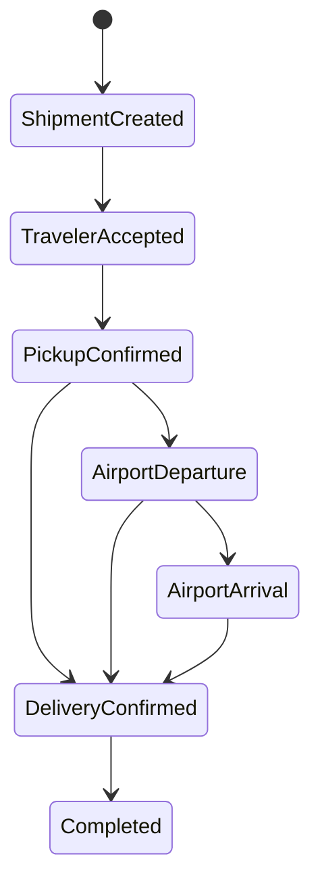

# Shipment Timeline

## Purpose

Define the Milestone 8 provider-neutral shipment timeline foundation without creating a second operational lifecycle beside booking and custody.

## Operational domain review

Karri has three related but distinct records:

| Record | Authority | Meaning |
| --- | --- | --- |
| `Shipment.status` | Shipment listing | Whether the sender's marketplace listing is draft, active, closed, or cancelled |
| `Booking.status` and `statusHistory` | Participant agreement | The finite coordination state from pending through a terminal outcome |
| `CustodyEvent` | Operational audit history | An immutable fact about shipment responsibility or movement for one booking |

The shipment timeline is a read projection over `CustodyEvent`; it is not another mutable status aggregate. `ShipmentLifecycleEvent` narrows the existing custody type to records that contain a non-empty `shipmentId`. This keeps booking transitions authoritative and prevents a parallel shipment state from drifting.

The in-process `DomainEvent` bus remains a separate integration concern. It triggers local effects but is not a durable audit timeline.

## Current foundation

New custody writes persist both `bookingId` and `shipmentId`. `ShipmentTimelineRepository` exposes chronological list/watch operations by shipment, and `ShipmentTimelineService` validates the opaque shipment ID before delegation. The application and domain contracts import no Firebase types.

`FirebaseCustodyRepository` implements both the booking-scoped custody repository and the read-only shipment-timeline repository over the same `custodyEvents` collection. It never copies events into a second collection.

## Lifecycle rules

The canonical forward sequence is:

Airport departure and arrival are optional informational milestones. If arrival is recorded, departure must already exist. Delivery may follow pickup, departure, or arrival because airport events are not mandatory for every corridor.

`custodyStateMachine.ts` centralizes duplicate prevention and next-event validation for application use. Booking status rules still authorize who may cause the corresponding lifecycle action. Firestore independently checks authenticated participation, expected actor and booking state, deterministic event ID, shipment/booking linkage, allowlisted metadata, server time, and required predecessor events.

## Compatibility and limitations

Existing custody documents may not have `shipmentId`; the mapper reads those records with `shipmentId: null`, so booking-scoped timelines remain compatible. Shipment-level queries return only new records that carry the field. No automatic backfill is attempted in this milestone.

Firestore continues to authorize each event through its linked booking. A sender owns every booking for their shipment, so a sender shipment query has one consistent participant boundary. Travelers should continue using booking-scoped timelines: a shipment query could include another traveler's booking and Firestore correctly rejects the whole query rather than filtering results.

This remains a client-orchestrated MVP boundary. Cloud Function transactions, idempotent command handling, rule emulator coverage, correction events, evidence policy, and an approved historical backfill are required before production reliance.

## Out of scope

- UI work or a new tracking screen.
- Payments, disputes, GPS, maps, proof of delivery, signatures, evidence uploads, admin tooling, or carrier integrations.
- A second shipment status machine or a second timeline collection.
- Destructive custody edits or deletes.

## Related documents

- [Booking State Machine](booking-state-machine.md)
- [Custody Model](custody-model.md)
- [Repository Pattern](repository-pattern.md)
- [Database Design](../engineering/database-design.md)
