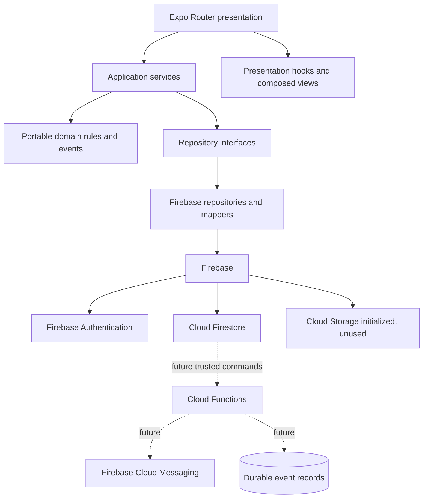

# Technical Architecture

## Purpose

Define the current runtime architecture and the target dependency direction for the fresh Karri Mobile application.

## Scope

This document covers the Expo app, domain and application foundations, Firebase infrastructure, Firestore, trusted backend direction, and documentation. It does not describe the retired Karri monorepo.

## Current implementation

Karri Mobile is a fresh Expo React Native application backed by Firebase. It does not use the previous Turborepo, pnpm workspace, Azure services, Prisma, or deployment topology.

The current mobile path is layered:

- Authenticated users create owner-scoped shipments/trips through services.
- Home watches active inventory, computes exact matches, and requests bookings.
- Tracking watches participant bookings/custody and invokes guarded service actions.
- Profile watches notifications and displays visible-evidence trust summaries.
- Firestore rules and server timestamps enforce the current MVP persistence boundary.

Milestone 5 connects booking, custody, in-app notification, review, and trust-display foundations to mobile screens. Remote Config, push channels, and authoritative trust persistence remain unconnected.

## Design principles

- Dependencies point inward: presentation to application to domain contracts.
- The domain owns business rules; infrastructure only persists and maps data.
- Firebase and Firestore imports stay in infrastructure.
- Trusted multi-party transitions run in Cloud Functions, not on one participant's device.
- Current implementation status must be explicit in code and documentation.
- Domain events are completed facts, not commands.

## Future direction

Cloud Functions will replace client-orchestrated sensitive persistence with transactional booking, custody, review, notification, and trust commands. Durable server events will support at-least-once consumers, while the local event bus remains useful for in-process reactions and tests.

Firebase Remote Config, FCM, App Check, and offline persistence require their own validated adapters and rollout gates before activation. Expo/EAS will eventually package releases, and Firebase CLI automation will deploy reviewed rules, indexes, and functions.

## Out of scope

- Major UI redesign beyond the booking/trust flow.
- Deploying Cloud Functions or changing Firestore security rules.
- Treating mobile validation alone as an authorization boundary.
- Payments, disputes, chat, SMS, AI matching, admin tooling, or a web app.

## Related documents

- [Architecture Overview](README.md)
- [Domain Model](domain-model.md)
- [Repository Pattern](repository-pattern.md)
- [Application Services](application-services.md)
- [Event Bus](event-bus.md)
- [System Architecture](../engineering/system-architecture.md)
