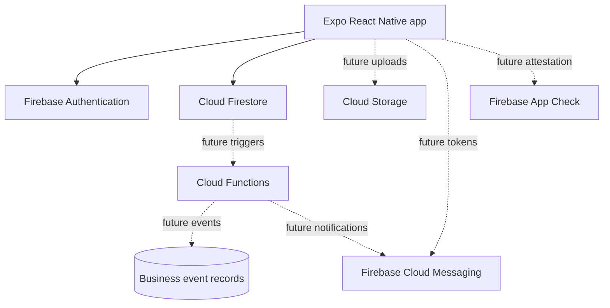

# Technical Architecture

## Current system

Karri Platform v2 is a fresh Expo React Native application backed by Firebase. It does not use the previous Karri Turborepo, pnpm workspace, Azure services, Prisma, or deployment topology.

## Implemented boundary

The mobile app uses Expo Router screens and a small shared component/theme layer. A safe Firebase module reads public Expo environment variables, exposes readiness state, and initializes Auth, Firestore, and Storage only when configuration is complete.

The implemented data path is deliberately direct and narrow:

- Authenticated users create `shipments` and `trips` with their Firebase UID as owner.
- Screens subscribe to owner-scoped lists for the user's records.
- The Home tab subscribes to active shipment and trip inventory and computes exact corridor matches locally.
- Server timestamps populate authoritative creation and update times.

No server functions are currently deployed by this repository. No code claims that future placeholders such as FCM or App Check are active.

## Trusted backend boundary

Direct client writes are acceptable for owner-controlled listing data under Firestore rules. Multi-party or trust-sensitive operations will use callable Cloud Functions:

- Booking request creation and response.
- Booking state transitions.
- Custody event append and evidence validation.
- Review eligibility and submission.
- Notification fan-out.
- Trust score recalculation.

This prevents one participant's device from declaring a sensitive outcome unilaterally.

## Event direction

The target architecture records durable domain events after a validated state change. Events support notifications, audit, analytics, and future integrations. The current listing slice stores state only; event production begins when Cloud Functions own multi-step lifecycle operations.

## Data stores

- **Cloud Firestore:** user/profile, listing, booking, custody, review, and notification documents.
- **Cloud Storage:** future package/custody evidence objects; initialized in the client but unused by current flows.
- **Authentication:** account identity and session state.
- **Remote Config:** future non-secret rollout and corridor configuration.

## Security posture

Firebase web configuration identifies the project but is not treated as a secret. Access control depends on Authentication, Firestore/Storage rules, server validation, App Check when enabled, and monitoring. Service-account keys and private credentials never belong in the mobile app.

## Deployment direction

Expo/EAS will package the mobile app. Firebase CLI will eventually deploy rules, indexes, Storage rules, and Cloud Functions. GitHub Actions currently validates and publishes MkDocs; mobile and Firebase deployment workflows are future work.
