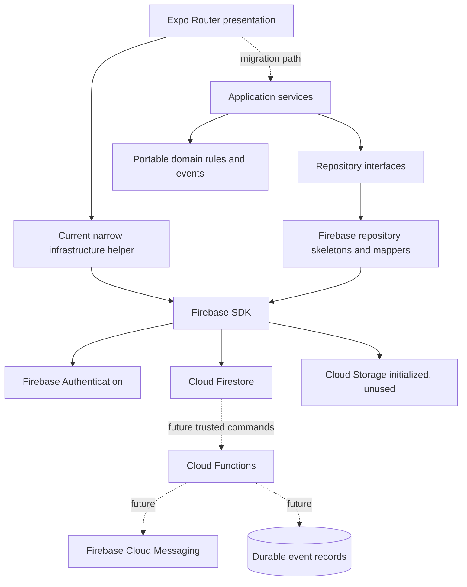

# Technical Architecture

## Purpose

Define the current runtime architecture and the target dependency direction for the fresh Karri Mobile application.

## Scope

This document covers the Expo app, domain and application foundations, Firebase infrastructure, Firestore, trusted backend direction, and documentation. It does not describe the retired Karri monorepo.

## Current implementation

Karri Mobile is a fresh Expo React Native application backed by Firebase. It does not use the previous Turborepo, pnpm workspace, Azure services, Prisma, or deployment topology.

The current shipped listing path remains direct and narrow:

- Authenticated users create `shipments` and `trips` with their Firebase UID as owner.
- Screens subscribe to owner-scoped lists and active inventory.
- Home computes exact corridor matches locally.
- Firestore server timestamps are authoritative for current records.

Milestone 4 adds plain domain models, repository contracts, application services, a synchronous in-memory event bus, Firestore mappers, and Firebase repository skeletons. These are compile-safe foundations, not a claim that booking, custody, reviews, notifications, trust display, or Remote Config are live.

## Design principles

- Dependencies point inward: presentation to application to domain contracts.
- The domain owns business rules; infrastructure only persists and maps data.
- Firebase and Firestore imports stay in infrastructure.
- Trusted multi-party transitions run in Cloud Functions, not on one participant's device.
- Current implementation status must be explicit in code and documentation.
- Domain events are completed facts, not commands.

## Future direction

Existing listing screens will migrate behind application services without changing user-visible behavior. Cloud Functions will then implement transactional booking, custody, review, notification, and trust commands. Durable server events will support at-least-once consumers, while the local event bus remains useful for in-process reactions and tests.

Firebase Remote Config, FCM, App Check, and offline persistence require their own validated adapters and rollout gates before activation. Expo/EAS will eventually package releases, and Firebase CLI automation will deploy reviewed rules, indexes, and functions.

## Out of scope

- Rewriting existing screens in this milestone.
- Deploying Cloud Functions or changing Firestore security rules.
- Treating repository skeletons as an authorization boundary.
- Payments, disputes, chat, SMS, AI matching, admin tooling, or a web app.

## Related documents

- [Architecture Overview](README.md)
- [Domain Model](domain-model.md)
- [Repository Pattern](repository-pattern.md)
- [Application Services](application-services.md)
- [Event Bus](event-bus.md)
- [System Architecture](../engineering/system-architecture.md)
