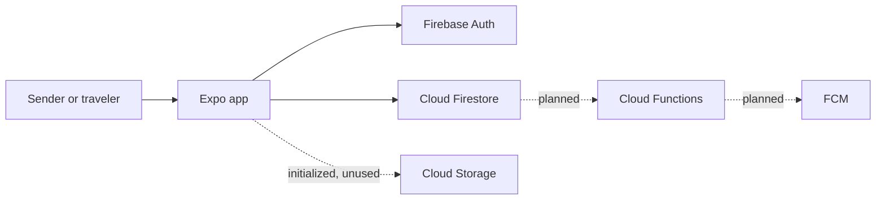

# System Architecture

## Scope

Karri Platform v2 currently consists of one Expo mobile application, Firebase client integration, Firebase rules/index configuration, and a MkDocs handbook. There is no separate application server, monorepo orchestrator, ORM, or cloud deployment layer.

## Runtime components

- **Mobile:** routes, forms, validation, local match computation, and presentation.
- **Authentication:** Firebase user identity and persisted session.
- **Firestore:** authoritative listing state and future platform records.
- **Storage:** initialized for future evidence uploads; no current upload flow.
- **Cloud Functions:** accepted trusted-command boundary, not yet implemented.

## Current data flows

1. Firebase configuration is read from `EXPO_PUBLIC_FIREBASE_*` variables.
2. A user enters the existing auth flow. Until production email sign-in is built, the verification action creates or reuses an anonymous Firebase Auth session.
3. Shipment and trip screens require that authenticated session.
4. Create helpers attach the authenticated UID, active status, and server timestamps.
5. Realtime listeners return owner-scoped listings or active market listings.
6. The Home screen pairs active shipments and trips with exactly equal normalized corridor fields.

## Failure boundaries

- Missing Firebase configuration prevents SDK initialization and produces a user-readable setup message.
- Missing Auth produces an explicit sign-in state rather than a write with a fabricated owner.
- Listener errors become screen error states and listeners are detached on unmount.
- Firestore rules remain the final client-access boundary even when UI validation exists.

## Future trusted flow

Booking and custody operations will call Cloud Functions. Functions validate the command, transact state, append an event, and let idempotent handlers send notifications. This boundary is documented now but is not represented as deployed code.
