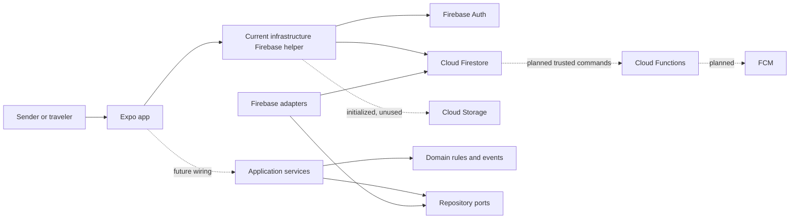

# System Architecture

## Scope

Karri Mobile consists of one Expo application, Firebase client integration, versioned Firebase rules/index configuration, portable domain/application foundations, Firebase repository skeletons, and a MkDocs handbook. There is no separate application server, ORM, or deployed Cloud Function in this repository.

## Runtime components

## Current data flows

1. Firebase configuration is read from `EXPO_PUBLIC_FIREBASE_*` variables.
2. The MVP verification action starts or reuses an anonymous Firebase Auth session.
3. Shipment and trip screens require that authenticated session.
4. Current helpers attach the UID, active status, and server timestamps.
5. Realtime listeners return owner-scoped or active-market records.
6. Home computes exact corridor matches locally.

Milestone 4 code provides a target service/repository/event path, but no composition root has replaced the current listing helpers.

## Failure and trust boundaries

- Missing configuration prevents Firebase initialization with a readable setup message.
- Missing Auth prevents ownerless data writes.
- Firestore rules remain the final direct-client access boundary.
- Repository skeletons for denied collections are not operational features.
- Domain validation improves consistency but cannot authorize an untrusted device.
- Cloud Functions will validate and transact multi-party commands.

## Future trusted flow

A mobile command calls a versioned Cloud Function. The function authenticates the actor, validates current state and idempotency, transacts records, appends a durable event, and lets idempotent handlers materialize in-app notifications. The client re-reads authoritative state.

See [Technical Architecture](../architecture/technical-architecture.md), [Repository Pattern](../architecture/repository-pattern.md), and [API Design](api-design.md).
