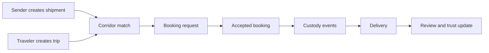

# Karri Platform v2

Karri is a mobile-first peer-to-peer cross-border shipping platform. It helps diaspora senders find travelers already moving along the same corridor, then makes responsibility and package custody visible from request through delivery.

The first market is the East African diaspora. The product is designed to expand corridor by corridor without weakening the local trust, clarity, and reliability that make the first corridors work.

## Product promise

> I know who I am coordinating with, what we agreed to, who has the package, and what happens next.

Karri is guided by four operating values:

- **Trust:** identity, reputation, and custody signals must be understandable.
- **Transparency:** status, expectations, and limitations must be visible.
- **Reliability:** important transitions must be recorded and recoverable.
- **Simplicity:** a first-time sender or traveler should know what to do next.

## Current product slice

The repository currently contains an Expo Router mobile app and a Firebase client foundation. The implemented MVP slice supports authenticated users creating and listing their own shipment and trip records, plus exact origin/destination corridor matching on the Home tab.

Booking requests, payments, messaging, custody transitions, notifications, reviews, and calculated trust scores are documented future work. They are not presented as implemented.

## Platform direction

Start with the [Executive Summary](strategy/executive-summary.md), then use the Product, Architecture, and Engineering sections as the source of truth for implementation decisions.
