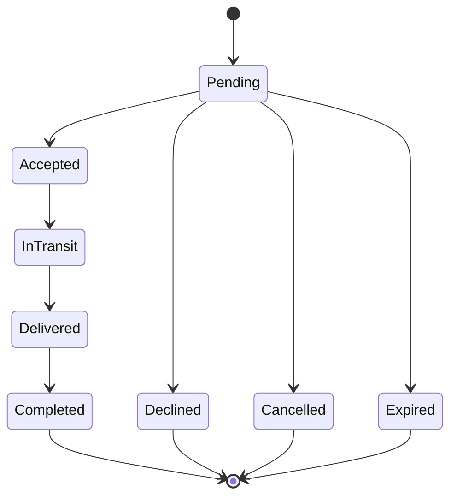

# Booking Lifecycle

## Current status

Milestone 4 implements the portable booking/request models, forward-only state guards, application orchestration, domain events, and a Firebase repository skeleton. No booking UI or callable function exists, and current Firestore rules still deny booking records. A possible match does not create a booking.

## Lifecycle

No backward or additional transitions are permitted. The code stores lowercase values: `pending`, `accepted`, `in_transit`, `delivered`, `completed`, `cancelled`, `declined`, and `expired`.

## Actor rules

- The sender creates and may cancel a pending request.
- The traveler accepts or declines, starts transit, and marks delivery.
- The sender completes a delivered booking.
- Only a trusted system actor expires a request.
- Production commands derive actor identity from Firebase Auth; they never trust an actor ID sent by the client.

## Invariants

- A booking links one shipment, one trip, one sender UID, and one traveler UID.
- Sender and traveler are different accounts.
- Listing ownership, active state, corridor, dates, category, and capacity must be revalidated by trusted code.
- Request and booking state change transactionally.
- Accepted terms are snapshotted so listing edits cannot rewrite the agreement.
- Custody changes append events rather than overwrite history.
- Reviews require `completed` state.

## Command boundary

The current mobile `BookingService` demonstrates validation and event behavior, but production request/transition execution belongs in callable Cloud Functions with transactions, version checks, idempotency, and durable events.

## Open decisions

- Expiration duration and capacity reservation.
- Recipient confirmation and completion policy.
- Cancellation reasons and exception handling.
- Terms snapshot shape and supported package categories.
- Payment policy, which remains outside this milestone.

See [Booking State Machine](../architecture/booking-state-machine.md), [Custody Model](../architecture/custody-model.md), and [API Design](../engineering/api-design.md).
