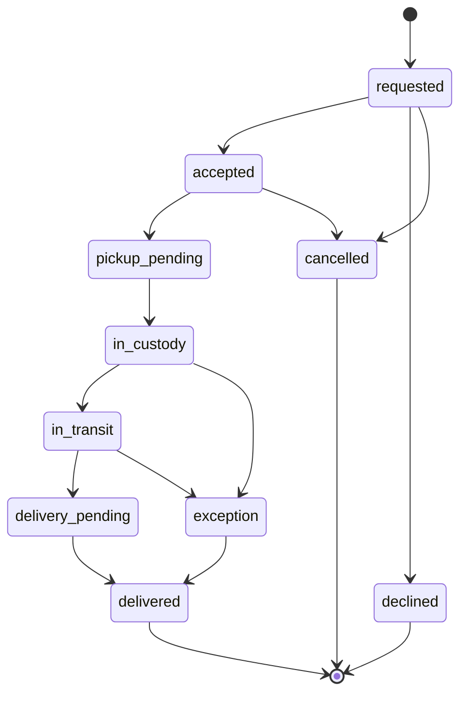

# Booking Lifecycle

## Current status

Bookings are not implemented. The codebase defines placeholder types and denies direct client access to booking records. A possible match does not create a booking request.

## Planned lifecycle

Exact state names may change when booking and operations requirements are implemented. They must remain finite, documented, and server-validated.

## Invariants

- A booking links one shipment, one trip, one sender UID, and one traveler UID.
- The sender owns the shipment and the traveler owns the trip at request time.
- Both listing records remain compatible and active when a request is created.
- Only the traveler can accept or decline the request.
- A transition validates the current version/state and is idempotent.
- Accepted terms are snapshotted so later listing edits cannot rewrite the agreement.
- Custody changes append events; they do not overwrite history.
- Reviews become eligible only after an accepted completion policy is met.

## Command boundary

Request, accept, decline, cancellation, pickup, and delivery are future Cloud Function commands. Firestore rules will deny clients from setting authoritative booking state directly.

## Open decisions

- Booking expiration and response time.
- Capacity reservation and competing requests.
- Cancellation reasons and policy.
- Recipient confirmation.
- Exception/support workflow.
- Payment or fee handling, which remains outside the current MVP.
