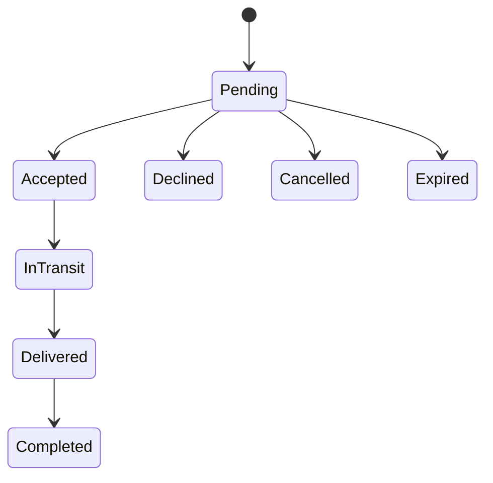

# Booking Lifecycle

## Current implementation

Milestone 5 connects exact-corridor matches to persisted Firestore booking requests. A sender who owns the matched shipment can request the matched traveler. The repository creates deterministic `bookingRequests` and `bookings` documents in one Firestore batch, then `BookingService` publishes `booking.requested` and appends the first custody event.

Travelers see participant-scoped pending bookings in Tracking and can accept or decline. Senders may cancel a pending request. Accepted bookings continue through pickup, delivery, and sender completion.

Expired remains a trusted-system state with no current client action.

## Actor and transition rules

- Sender: request, cancel while pending, complete after delivery.
- Traveler: accept, decline, confirm pickup, and confirm delivery.
- No terminal state has an outgoing transition.
- Service guards and Firestore rules both reject backward or unauthorized transitions.
- Request and booking outcomes change together in a Firestore batch.
- Deterministic shipment/trip booking IDs prevent duplicate requests for the same pair.

## Operational booking experience

The Tracking tab uses a service-level activity subscription for participant bookings and requests, then composes related data through application services. Each booking now presents:

- booking status and request note;
- sender/traveler roles and the signed-in participant's self-readable identity badge;
- shipment, route, schedule, listing, and current operational status;
- a compact visible trust summary for the other participant;
- the recommended next action and only the role-eligible controls;
- custody summary, shipment timeline, and a combined activity feed;
- one review form per participant after completion.

The screen does not infer another participant's private verification state. Other-user trust remains limited to the evidence scope returned by `TrustService`.

## Current trust boundary

Milestone 5 uses Firebase Auth plus participant-scoped Firestore rules as the executable policy boundary because Cloud Functions remain outside scope. Rules revalidate active listing ownership, exact corridor fields, capacity, participants, current state, immutable core fields, and appended status history.

This is an MVP boundary, not the final production command architecture. Cloud Functions, emulator tests, idempotent command receipts, expiration automation, and atomic booking/custody/event effects remain required before production.

## Open decisions

- Expiration duration and capacity reservation.
- Recipient confirmation and exception handling.
- Terms snapshots beyond the linked listing records.
- Payment and dispute policy, which remain out of scope.

See [Booking State Machine](../architecture/booking-state-machine.md), [Chain of Custody](chain-of-custody.md), and [API Design](../engineering/api-design.md).
