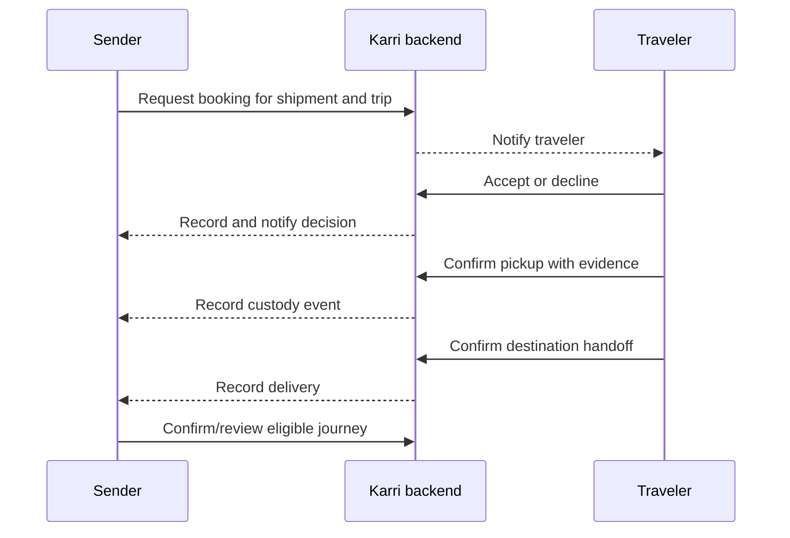

# User Journeys

## Current sender journey

1. The user opens the existing sign-in flow.
2. In this MVP foundation, the verification action explicitly starts or reuses an anonymous Firebase Auth session; production email verification is not yet implemented.
3. The user opens **Send** and sees configuration/auth, loading, error, empty, or listing state as appropriate.
4. The user enters origin and destination country/city, category, description, weight, delivery window, and reward.
5. Client validation identifies missing or invalid values.
6. Firestore creates an active shipment with the authenticated UID and server timestamps.
7. The realtime owner list shows the shipment and the form clears.
8. Home may show exact route matches when an active compatible trip exists.

## Current traveler journey

1. An authenticated user opens **Travel**.
2. The user enters route, departure and arrival dates, available capacity, and optional notes.
3. The app validates required values, positive capacity, ISO date format, and date order.
4. Firestore creates an active trip owned by the authenticated UID.
5. The realtime owner list shows the trip and the form clears.
6. Home may pair it with active shipments on the exact same corridor.

## Current match journey

1. Home subscribes to active shipment and trip inventory.
2. The app normalizes case and surrounding whitespace for four route fields.
3. An exact origin country/city and destination country/city match becomes a possible match card.
4. The card provides context only. It does not rank, request a booking, charge money, or promise compatibility by date/weight.

## Future booking and custody journey

Every future step needs explicit failure, cancellation, and support paths before implementation.
